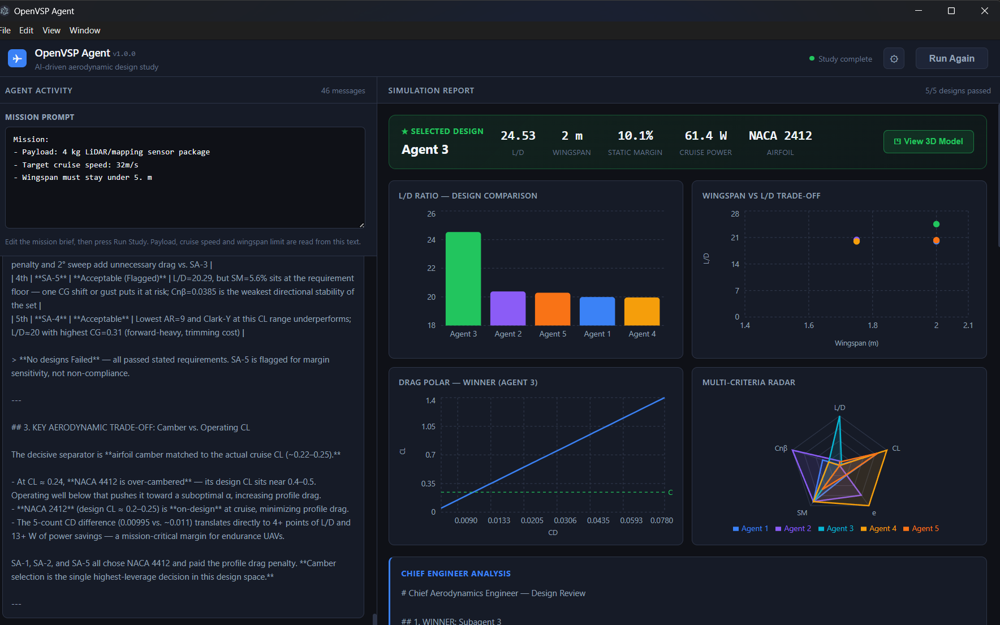
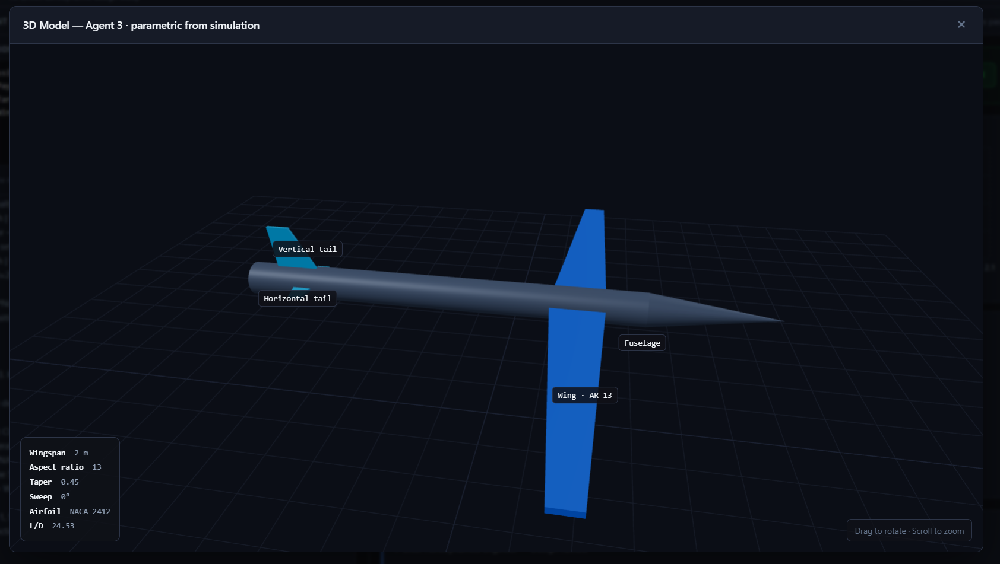
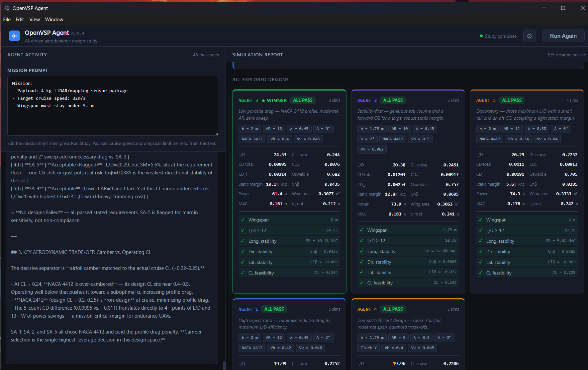

# OpenVSP Agent

An AI-driven aerodynamic design harness for fixed-wing UAVs, built as an Electron desktop app —
"Claude Code for OpenVSP". You give it a mission brief; a team of AI agents explores wing/tail
configurations in parallel, runs aerodynamic simulations, and reports the best design with the
reasoning behind it.



## What it does

From a single mission prompt, the app runs a multi-agent conceptual-design study:

- An **orchestrator** (Claude Sonnet) plans the search and writes the final engineering synthesis.
- **5 subagents run in parallel** (Claude Opus), each pursuing a different design philosophy
  (high aspect ratio, stability-first, low parasite drag, compact, exploratory). Each one calls a
  `run_simulation` tool, reads the aerodynamic results, and **iterates on the parameters it thinks
  matter** (CG position, tail volume, AR, taper, sweep, airfoil).
- The best design that satisfies **all** requirements (wingspan limit, L/D, longitudinal /
  directional / lateral stability, and cruise-CL feasibility) is selected as the winner.

The UI has two fixed panels: a **chat** showing live agent activity, and a **report** with charts,
a winner banner, and a card for every explored design. An optional **parametric 3D model** of the
winner is generated from its actual simulation parameters.

## Features

- **Editable mission prompt** — payload mass, cruise speed and wingspan limit are parsed straight
  from the text and drive both the agents and the physics.
- **Per simulation:** the parameters tested, the aerodynamic results used to compare designs, and a
  clear pass/fail against every requirement.
- **Report charts:** L/D comparison, wingspan-vs-L/D trade-off, drag polar of the winner, and a
  multi-criteria radar — plus a "Chief Engineer" synthesis explaining why the winner beats the rest.
- **Optional 3D preview** — a parametric Three.js model built from `BoxGeometry`/`ExtrudeGeometry`
  primitives, so a high-AR wing visibly differs from a compact low-AR one. Orbit to rotate, scroll
  to zoom; key parts are labelled.
- **In-app API key settings** (⚙) — stored locally and encrypted via the OS keychain; required for
  the packaged `.exe`, which has no `.env`.
- **Robust runs** — cancelling actually aborts in-flight work, one failing subagent no longer sinks
  the whole study (`Promise.allSettled`), and the Anthropic client retries with backoff on rate limits.

## Screenshots

| Parametric 3D model | All explored designs |
|---|---|
|  |  |

## Stack

- **Electron Forge + Vite**
- **React + plain JSX + CSS**
- **Anthropic SDK** (Claude API) for the orchestrator and subagents
- **Recharts** for the report charts
- **@react-three/fiber + @react-three/drei + three** for the 3D preview

## Setup

1. Clone the repo:
   ```
   git clone https://github.com/OleksanderZabila/Elektron.git
   cd Elektron
   ```
2. Install dependencies:
   ```
   npm install
   ```
   > **Note for Windows users with non-ASCII paths** (e.g. Cyrillic in username): `npm install`
   > automatically runs a `postinstall` script that ensures the Electron binary is correctly
   > extracted — no manual steps needed.
3. Provide an Anthropic API key (either option works):
   - **In-app:** launch the app, click the ⚙ (Settings) button, paste your key. It is stored
     locally and encrypted via the OS keychain (DPAPI on Windows). This is the only option for the
     packaged `.exe`.
   - **Dev / .env:** create a `.env` file in the project root:
     ```
     ANTHROPIC_API_KEY=sk-ant-...
     ```
4. Run:
   ```
   npm start
   ```

## Usage

1. Edit the **Mission Prompt** at the top of the left panel (pre-filled with the default
   surveillance-drone brief). Payload mass, cruise speed and wingspan limit are read from this text.
2. Press **Run Study** to launch the 5 parallel subagents.
3. Watch live activity on the left; the report builds on the right and is complete in ~2–3 minutes
   (depends on API speed). Open the **View 3D Model** button in the winner banner to inspect the
   geometry.

> How many designs pass depends on the mission: a tight brief produces a mix of pass/fail, a relaxed
> one can pass all five. The winner is always the best L/D among the designs that pass every requirement.

## Building a Windows .exe

```
npm run build:win
```

Produces a runnable app at `out/openvsp-agent-win32-x64/openvsp-agent.exe`. The packaged app has no
`.env`, so enter the API key via the in-app ⚙ Settings dialog on first run.

> **Why not `electron-forge make`?** Under Node 26, `@electron/packager` (used by Forge's
> `package`/`make`) silently aborts during its finalize step and produces no output. `build:win`
> reuses Forge's production Vite build and then assembles the app around the prebuilt Electron
> runtime via `scripts/assemble.mjs`, which is immune to that bug. See `future_work.md` for the path
> to a signed installer.

## Note on the aerodynamics

> ⚠️ The aerodynamics are a **stub**, not a real solver. `src/agent/openvsp-mock.js` is a
> physics-based mock (lifting-line theory + DATCOM-style empiricals, with a controllable CG and a
> static-margin model). It is plausible and internally consistent, but no result should be trusted
> operationally until it is replaced with a real OpenVSP/VSPAERO solve. See `future_work.md` for the
> integration plan and the limitations of the stability model.
